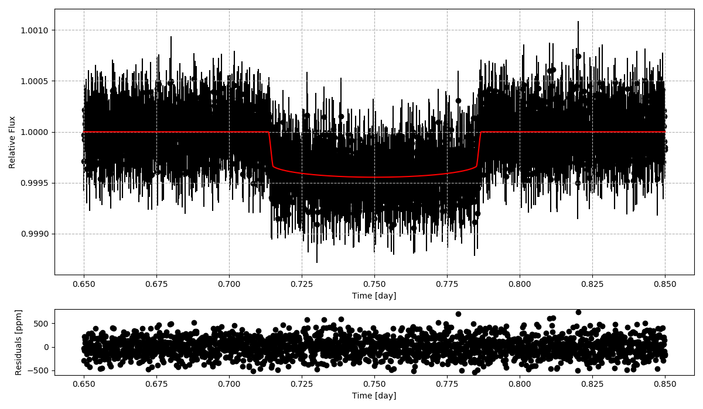
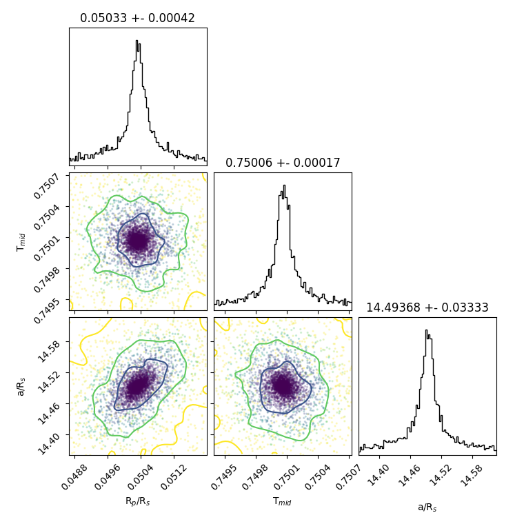

# Exoplanet Light Curve Analysis

A python 3 package for modeling exoplanet light curves. The transit function is based on the analytic expressions of Mandel and Agol 2002. Estimate parameters and uncertainties using nested sampling.

## Dependencies
- Numpy, Matplotlib, [Dynesty](https://dynesty.readthedocs.io/en/latest/index.html)





The data points are color coded to the likelihood value. Contours are plotted for the 1 and 2 sigma level. The dotted lines show the 2 sigma level which encompasses ~95% of solutions.

## Running the package
```python
from ELCA import lc_fitter

import matplotlib.pyplot as plt
import numpy as np
import dynesty

if __name__ == "__main__":

    prior = { 
        'rprs':0.06,        # Rp/Rs
        'ars':14.07,        # a/Rs
        'per':3.336817,     # Period [day]
        'inc':88.75,        # Inclination [deg]
        'u1': 0.3, 'u2': 0.01, # limb darkening (linear, quadratic)
        'ecc':0,            # Eccentricity
        'omega':0,          # Arg of periastron
        'tmid':0.75         # time of mid transit [day]
    } 

    # GENERATE NOISY DATA
    t = np.linspace(0.5,1.,2000) # [day]
    data= transit(t, prior) + np.random.normal(0, 2e-4, len(t))
    dataerr = np.random.normal(300e-6, 50e-6, len(t))

    # create bounds only for the free parameters
    mybounds = {
        'rprs':[0,0.1],
        'tmid':[min(t),max(t)],
        'ars':[13,15]
    }

    # fit the light curve
    myfit = lc_fitter(t, data, dataerr, prior, mybounds)
    
    # print final parameters
    for k in myfit.bounds.keys():
        print(myfit.finalpars[k], '+-', myfit.errors[k])

    # light curve plot with residuals
    fig,axs = myfit.bestfit_plot()
    plt.show()

    # triangle plot
    fig,axs = dynesty.plotting.cornerplot(myfit.results)
    plt.show()
```

See the class `lc_fitter` in order to define a custom likelihood function e.g. to include corrections for residual curvature or airmass variations.