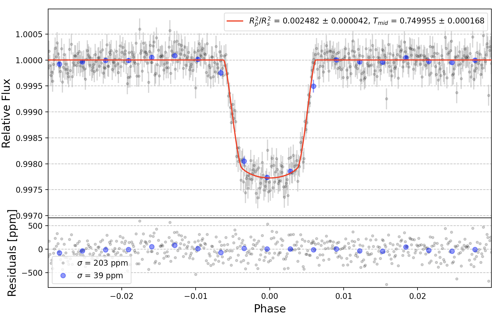

# Exoplanet Light Curve Analyzer

Pronouned like "elsa"

A python 3 package for modeling exoplanet light curves. The transit function is based on the analytic expressions of Mandel and Agol 2002. Estimate parameters and uncertainties using nested sampling. 




The data points are color coded to the likelihood value and the contours represent different sigma levels. One sigma uncertainties are reported above each histogram.

## Dependencies
- Numpy, Matplotlib, Cython, Ultranest

## Installation
1. `pip install git+https://github.com/pearsonkyle/Exoplanet-Light-Curve-Analysis.git`

## Examples

### Quickstart
```python
import numpy as np
import matplotlib.pyplot as plt

from elca.tools import transit, lc_fitter

if __name__ == "__main__":

    prior = { 
        'rprs':0.05,        # Rp/Rs
        'ars':14.5,         # a/Rs
        'per':3.336817,     # Period [day]
        'inc':86.5,         # Inclination [deg]
        'u1': 0.3, 'u2': 0.1, # limb darkening
        'ecc':0,            # Eccentricity
        'omega':0,          # Arg of periastron
        'tmid':0.75         # time of mid transit [day]
    } 

    # GENERATE NOISY DATA
    time = np.linspace(0.65,0.85,500) # [day]
    data = transit(time, prior) + np.random.normal(0, 2e-4, len(time))
    dataerr = np.random.normal(300e-6, 50e-6, len(time))

    mybounds = {
        'rprs':[0,2*prior['rprs']],
        'tmid':[min(time),max(time)],
        'ars':[13,16], 
        #'inc':[85,87]
    }

    myfit = lc_fitter(time, data, dataerr, prior, mybounds)
    
    for k in myfit.bounds.keys():
        print("{:.6f} +- {}".format( myfit.parameters[k], myfit.errors[k]))

    fig,axs = myfit.plot_bestfit()
    plt.show()

    myfit.plot_triangle()
    plt.show()
```

## Phase curve fitting

[examples/phasecurve_fitting.py]()

[examples/interactive_sliders.py]()


## Non-linear limb darkening

[examples/transit_nl_fitting.py]()

[examples/Model Comparison.ipynb]()

## Multiple light curve fitting

[Fit multiple light curves simultaneously with local and global bounds](examples/global_fitter.py)


## Exomoon

[Forward model using Kepler's 3rd law](examples/exomoon.py)


